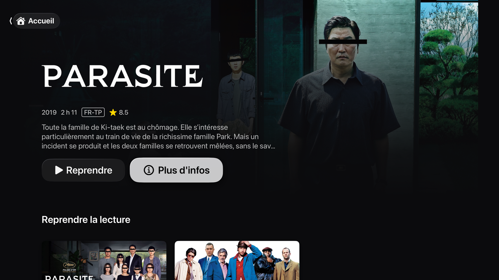

<div align="center">


# Sofafin

**A native Jellyfin client for Apple TV.** Written in SwiftUI, built on AVKit, and
designed to be watched from a couch rather than inspected up close.

[](https://developer.apple.com/tvos/)
[](https://swift.org)
[](LICENSE)

**English** · [Français](README.fr.md)



</div>

---

## Why

Jellyfin already knows how to serve a media library. What was missing on Apple TV
was a client that behaves like the apps the system ships itself: a large backdrop
that reacts to focus, rows that scroll without stutter, and above all **Apple's
player rather than a home-grown one**.

That is the project's central bet: `AVPlayerViewController`, driven through its
official extension points. It buys the system transport bar, Picture in Picture,
AirPlay, the Now Playing panel, subtitles and audio track selection — everything no
custom implementation would truly match.

## What it does

- **Home** — a full-frame backdrop that follows focus, resume playback, next up,
  recently added, favourites, collections, and genre rows inferred from your library
- **Player** — skip intro, chapters, next-episode hand-off with a countdown,
  swipe-down info panels, Picture in Picture, resume to the second
- **Libraries** — grid with sorting and filters, series pages season by season,
  collections, tappable cast
- **Top Shelf** — resume and next up right on the system home screen, deep-linking
  straight to playback or to the item page
- **Quick Connect** — a code appears on screen and is approved from your phone,
  instead of typing a password with the remote
- **Accessibility** — VoiceOver, Larger Text, Bold Text, Increase Contrast and
  Reduce Motion

## What it does not do

Worth saying plainly:

- **No direct play of Matroska files.** AVFoundation cannot read MKV. The server
  **remuxes** on the fly — the container changes, neither picture nor sound is
  touched — which costs a few percent of CPU, not a re-encode. A client shipping its
  own decoder, such as Infuse, does not have this constraint; it gives up system
  integration in exchange.
- **No server administration.** No users, no scheduled tasks, no plugins.
- **No music, books or live TV.** Movies and shows.
- **No offline downloads.**

## Installation

No binary is distributed yet — you build it yourself.

### Requirements

- macOS with **Xcode 26** or newer
- [XcodeGen](https://github.com/yonaskolb/XcodeGen) — `brew install xcodegen`
- A **Jellyfin 10.10+** server reachable from the Apple TV
- To install on real hardware: an Apple developer account, free tier is enough

### Build

```bash
git clone https://github.com/McSon2/Sofafin.git
cd Sofafin
xcodegen generate
open Sofafin.xcodeproj
```

The Xcode project is **generated** from `project.yml`: never edit it by hand, it
gets overwritten. Re-run `xcodegen generate` after adding any file.

The simulator runs unsigned. To install on a real device, declare your team
identifier **without committing it**:

```bash
echo 'DEVELOPMENT_TEAM = YOURTEAMID' > Signing.local.xcconfig
xcodegen generate
```

### First connection

On launch, enter your server address (`192.168.1.10:8096`, or a hostname). Scheme
and port are guessed if you leave them out. Then use Quick Connect — the code shown
on screen is approved from Jellyfin on another device, under
**Profile → Quick Connect**.

## A server setting worth knowing

If an **HDR or Dolby Vision** movie refuses to start, or your server runs hot when
it should merely be remuxing, look at Jellyfin's HDR → SDR conversion
(*tone mapping*, under Playback → Transcoding):

- it **forbids copying the video stream** and forces a full re-encode, expensive on
  a small machine;
- its OpenCL variant needs a runtime many installations do not have, in which case
  ffmpeg dies before the first frame and every segment answers `HTTP 500`.

Apple TV 4K displays HDR10, HLG and Dolby Vision natively: **turning it off gives a
better picture and an idle machine.**

## Architecture

```
Packages/JellyfinKit/     shared core, no UI dependency
  JellyfinClient          HTTP client, authorization, decoding
  Endpoints+*             authentication, library, images
  Playback                device profile, negotiation, session reporting
  CredentialStore         session persisted in the app group
  DeepLink                sofafin://play/<id> and sofafin://item/<id>

Apps/tvOS/Sources/
  AppSession              global state: auth phase, client, libraries
  Design/                 tokens, glass surfaces, cards, rows, accessibility
  Features/               Onboarding, Home, Detail, Library, Search, Settings, Player

Apps/TopShelf/            Top Shelf extension (separate process)
```

All logic lives in a UI-free Swift package, shared with the extension and already
cross-platform: **a macOS port would only require rewriting the views.**

`docs/NOTES-PLATEFORME.md` (in French) documents the structural decisions and the
platform traps already paid for — recommended reading before touching the player.

## Contributing

Contributions are welcome. Read [CONTRIBUTING.md](CONTRIBUTING.md): it covers
getting started, the project's conventions, and the few tvOS rules that must not be
undone by accident.

Most useful right now:

- **macOS port** — `JellyfinKit` is ready, only the views are missing
- **External subtitles in direct play**
- **Translations** — the interface ships in English and French
- **Testing against varied libraries** — exotic codecs are the main source of
  surprises

## Privacy

The app talks **only to the server you point it at**. No analytics, no trackers, no
third-party services, no data leaving your network. The session token — revocable
from Jellyfin, never your password — is kept locally so you do not have to sign in
again.

[Full privacy policy](https://maximesaltet.com/sofafin/privacy)

## License

[MIT](LICENSE).

This project is not affiliated with the Jellyfin project. Jellyfin is a trademark of
its respective owners.
